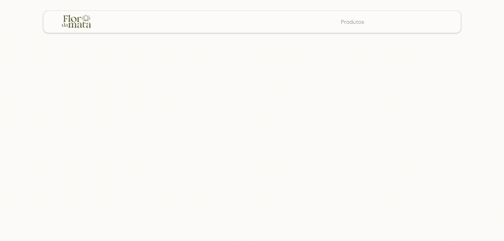
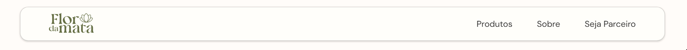

<div align="center">
<!-- Sugestão: um banner 1280x400 com a marca nova sobre fundo em tom terroso -->


# Flor da Mata

**Rebrand e site institucional B2B para uma distribuidora de produtos naturais**

[](https://react.dev)
[](https://vitejs.dev)
[](https://gsap.com)
[](https://figma.com)

</div>

## Sobre o projeto

Protótipo de redesign institucional para a **Flor da Mata**, distribuidora de produtos naturais. O site cobre duas funções B2B, sem e-commerce nem pagamento:

- **Catálogo de produtos** para lojistas, organizado por categoria
- **Formulário de candidatura a parceria**, para novos lojistas se cadastrarem como revendedores

Funcionalidades de backend (envio real de formulários, autenticação, histórico de pedidos) ficam fora deste protótipo — são escopo pago separado.

## Identidade visual

| Cor                                                                   | Hex       | Uso                              |
| --------------------------------------------------------------------- | --------- | -------------------------------- |
|  Olive green  | `#5D673C` | cor primária, textos de destaque |
|  Cream | `#FFFEFA` | fundo                            |
|  Terracota    | `#B5713F` | acentos, hover, CTA              |

- **Tipografia:** [Cormorant Garamond](https://fonts.google.com/specimen/Cormorant+Garamond) (títulos editoriais) + [DM Sans](https://fonts.google.com/specimen/DM+Sans) (corpo e navegação)
- **Estética:** editorial, quente, artesanal — interações expressivas inspiradas no [MindMarket](https://mindmarket.com/)

## Stack

- [React](https://react.dev) + [Vite](https://vitejs.dev)
- [React Router](https://reactrouter.com)
- CSS Modules
- [GSAP](https://gsap.com) (`useGSAP`, ScrollTrigger, ScrollSmoother)

### Entrada da Home (Hero)

Timeline única e encadeada: título "A" desce, "NATUREZA" sobe com fade, slogan, botões e seta pulando — cada etapa começa antes da anterior terminar.



### Pin revelando o Products

Ao rolar a partir do topo, o Hero fica temporariamente pinado (encolhendo e com fade) enquanto o card de Products sobe naturalmente por cima.


### Navbar

Links entram com stagger ao carregar a página; hover é CSS puro (cor + leve scale com overshoot).



### Carrossel de categorias + Modal de produto

Auto-scroll contínuo via `requestAnimationFrame`, pausando ao expandir um card ou abrir o modal de produto.


### ScrollSmoother

Suavização de scroll aplicada ao site inteiro via `ScrollSmoother`.


## Estrutura de páginas

| Página   | Rota             | Descrição                                      |
| -------- | ---------------- | ---------------------------------------------- |
| Home     | `/`              | Hero animado + destaque de categorias/produtos |
| Products | `/produtos`      | Catálogo completo, filtrado por categoria      |
| About    | `/sobre`         | História da marca, timeline e selos            |
| Partner  | `/seja-parceiro` | Formulário de candidatura a parceria           |

## Categorias de produto

Chás & Ervas · Grãos e Cereais · Naturais Funcionais · Sementes · Farinhas e Farelos · Soja & Derivados · Elixires Xaropes e Óleos · Cápsulas e Suplementos · Beleza e Cuidados · Snacks e Açúcares

## Como rodar localmente

```bash
npm install
npm run dev
```

Outros scripts disponíveis: `npm run build`, `npm run preview`, `npm run lint`.

## Autor

Desenvolvido por **Ângelo Marques Ferreira** — protótipo para a Flor da Mata.
